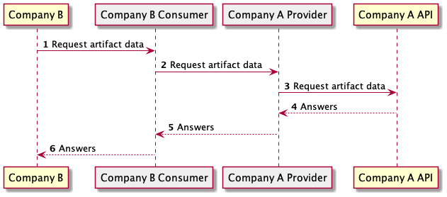
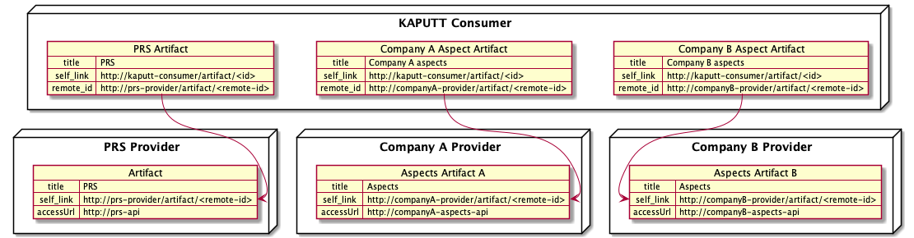
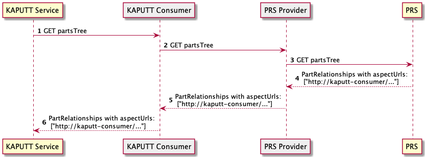
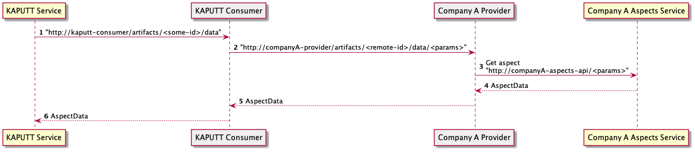

# Consume aspects

This document explains how KAPUTT GmbH will consume aspects in Speedboat.
It is a temporary setup as it can work if there is only one entity consuming aspects.

## Problem statement

If `Company A` wants to share an artifact with other companies, `Company A` has to create an artifact in the `Company A Provider` connector.
Then each company needs to establish a contract agreement between their consumer connector and the `Company A Provider` connector in order to access data
Each consumer stores an internal URL to access the artifact.

This diagram explains how `Company B` can consume data from `Company A` through connectors:

We can see that `Company B` calls the `Company B Consumer` to access `Company A`'s data.
Each company needs to use its own consumer to query the artifact from `Company A`.
It means that if `Company B` wants to access the artifact from `Company A` it will use the following URL: `http://company-b-consumer/artifacts/123/data` and for `Company C`  it would use: `http://company-c-consumer/artifacts/456/data`.
This fact makes it impossible to provide a common URL to access a specific artifact. Each company needs to negotiate a contract and generate its own URL to access the artifact.

This document provides a temporary solution to this problem. The solution would be implemented on the PRS service side.

## Consume aspects design

### Artifacts creation

If `KAPUTT Service` wants to consume the aspects from `Company A` and `Company B`:  
`Company A` needs to create an `Aspect Artifact A` inside its `Company A Provider` connector. The `Aspect Artifact A` contains an `accessUrl` pointing to an aspect API provided by `Company A`.
`Company B` needs to create an `Aspect Artifact B` inside its `Company B Provider` connector. The `Aspect Artifact B` contains an `accessUrl` pointing to an aspect API provided by `Company B`.
KAPUTT needs to create an agreement between its `KAPUTT Consumer` connector and `Company A Provider` connector, and a second agreement with `Company B Provider` connector.
This means that Kaputt consumer will contain three artifacts:

- `Company A Aspect Artifact` to access Aspect Artifacts from `Company A`
- `Company B Aspect Artifact` to access Aspect Artifacts from `Company B`
- `PRS Artifact` to access the `PRS API`

`PRS `is the service that provides artifact URLs to `KAPUTT` and then based on these URLs if `KAPUTT` needs to consume aspects from `Company A`, it will need to query its own consumer with the intended artifact-id.

This is why we propose the following temporary solution:  
`PRS` will be aware of the existing artifacts in the `KAPUTT Consumer` and will provide the correct prefix URL depending on the oneIDManufacturer.

### Sequence diagram

The following sequence diagram explains how the `KAPUTT Service` can obtain the correct URL to query aspects.
`Company A` could be a company like BMW or ZF that provides aspects.

It is important to note that PRS will provide the correct URL depending on the oneIDManufacturer.
KAPUTT will have one artifact registered per manufacturer. PRS will know these artifacts and provide the correct one to `KAPUTT Consumer`.
`KAPUTT Service` will obtain a URL on `KAPUTT Consumer` side, like this `http://kaputt-consumer/artifacts/UUID/data/<params>`.
It will need to use this URL to request the aspects.

The following sequence diagram explains how the `KAPUTT Service` can obtain the artifact data after getting the artifact URL from `PRS`.

### A potential future solution

A potential future solution working with several aspects consumer would be:

- `PRS` provides the URL of the artifact on the provider side.
- `KAPUTT` tries to retrieve the corresponding artifact in its consumer. If the artifact does not exist, it negotiates a contract to obtain an agreement and create an artifact in its consumer.

For now, we will not put effort into this solution.
